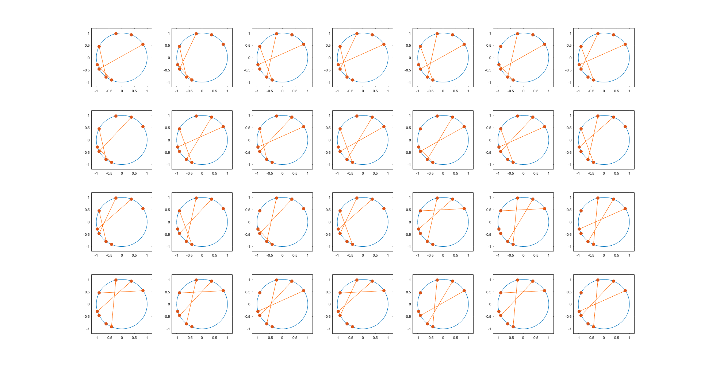

# This is a markdown file

This is _italic_ font.  
This is __bold__ font.  
`This is a small block.`  
```
This is a
big block.
```
```python
# This is a python code
print("Hello triangle!")
```
```matlab
% This is a matlab code
clear; clc;
for i=1:n
    fprintf('%d\n',i)
end
```
```c++
// This is a c++ code
#include <iostream>
using namespace std;
int main(){
    cout << "Hello triangle!" << endl;
    return 0;
}
```
